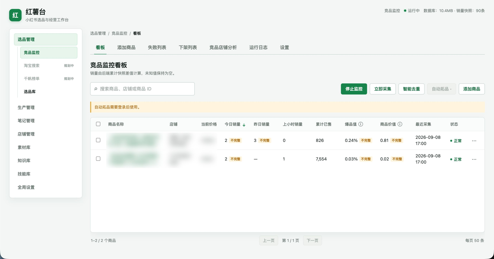

# 红薯雷达 Mac 本地版设计规格

- 日期：2026-09-09
- 状态：设计与正式文档已由用户确认；已吸收 2026-09-09 新增界面及同行研究参考
- 项目目录：本仓库根目录
- 核心依据：[冬青公开提示词](https://github.com/dong-liudong/hongshuleida/blob/main/dq.md)

## 1. 背景与目标

用户准备把“小红书虚拟资料”作为新学期的深耕方向，并以 2026 年 9 月月末实现人民币 3000 元利润为业务目标。红薯雷达是服务这一目标的第一件工具，不是目标本身。

首个版本的产品目标：在 72 小时内具备持续监控第一批 10–20 个真实商品的能力，用可信销量增量完成初筛，并推动至少 1 个商品进入人工复核和真实上架测试。

核心选品闭环继承冬青的方法：

> 收集线索 → 建立选品库 → 人工初筛 → 销量监控 → 数据分层 → 拆竞品 → 重新创作 → 小规模测试 → 放弃或放大

雷达只负责提供市场证据和排序，不代替人对人群、场景、问题、交付、内容、合规与利润的判断。

## 2. 已确认的产品约束

- 独立开发 Mac 版本，只使用冬青公开提示词，不使用或假定拥有其源代码。
- 本地运行，采用 Python 后台采集器、SQLite 和本地 Web 看板。
- 用户每天可以保证 23:50 至次日 00:05 期间 Mac 不休眠且联网。
- 不要求 Mac 或网络 24 小时在线；合盖、上课、通勤、坐飞机均是正常场景。
- 日级数据是核心，小时级数据只在 Mac 醒着时尽力采集。
- 失败绝不能保存为销量 0，未知必须明确显示为未知。
- v0 保持足够小，但数据、统计和接口边界必须允许后续完整功能接入。

## 3. v0 范围

### 3.1 包含

- 批量添加商品：支持分享文案、小红书短链、完整商品链接、24 位商品 ID。
- 调用公开商品详情接口并解析商品、店铺、价格与累计已售。
- SQLite 持久化商品、可信快照、采集尝试和人工判断。
- 每日 00:02 锚点采集。
- Mac 醒着时可选的小时级采集。
- 基于可信快照计算 24 小时增量、上一小时增量、爆品值和商品价值。
- 一张主榜单、批量添加抽屉、商品详情抽屉。
- 展示采集状态、数据完整性、连续有效天数和人工阶段。
- 本地 `launchd` 调度。

### 3.2 不包含

- Playwright 或其他浏览器兜底采集。
- 自动拓品。
- 店铺分析。
- 企业微信通知。
- MCP 服务。
- 独立 `.app` 或 DMG 打包。
- 远程服务器和真正的 24 小时在线采集。

这些能力在架构上预留接入点，但只有真实使用证明需要时才实现。

## 4. 总体架构

```text
分享文案 / 链接 / 商品 ID
          │
          ▼
     输入解析与去重
          │
          ▼
  公开接口采集适配器 ────── 未来：浏览器采集适配器
          │
          ▼
  响应校验与字段标准化
          │
          ├── 可信成功 ──► SQLite 快照
          └── 失败 ──────► SQLite 采集尝试记录
                                不产生销量快照
          │
          ▼
       共享统计核心
          │
          ├──► 本地 Web 看板
          ├──► 未来：企业微信通知
          └──► 未来：只读 MCP
```

分层职责：

1. 采集适配器只负责获取原始响应。
2. 校验层决定响应是否足以形成可信快照。
3. SQLite 是唯一事实源。
4. 统计核心统一完成时间窗口、增量、排序和数据质量判断。
5. Web 页面只读取统计结果，不自行重算业务指标。

这保证未来加入浏览器兜底、通知或 MCP 时，不需要改写已有快照和核心口径。

## 5. 数据来源与解析

v0 使用冬青提示词给出的公开接口：

```text
https://mall.xiaohongshu.com/api/store/jpd/edith/detail/h5/toc?version=0.0.5&item_id={商品ID}
```

当前依据提示词，从 `data.template_data[0]` 读取数据，并对所需子字段做完整性校验。具体字段路径集中写在一个解析器模块中，不散落在页面或统计代码里，以便接口结构变化时单点维护。

输入处理：

- 完整商品 URL：提取商品 ID。
- 分享文案：识别其中 URL，再提取商品 ID。
- `xhslink.com` 短链：跟随有限次重定向，得到完整 URL。
- 24 位商品 ID：直接标准化。
- 多行输入：逐行解析、去空、去重，并返回每行结果。

销量文本至少覆盖：

- `123` → 123
- `1.2万` → 12000
- `1.2w` / `1.2W` → 12000
- 空字段只有在完整、成功的业务响应中才可能解释为真实 0；请求失败、结构缺失或页面异常不得解释为 0。

## 6. 可信快照规则

形成销量快照必须同时满足：

1. HTTP 请求成功。
2. 业务响应明确为 `success=true`。
3. `template_data` 和当前版本要求的商品字段完整。
4. 销量与价格字段能够按规则解析。

失败时只记录采集尝试和错误原因，不新增销量快照。

累计销量统计使用可信高水位：短期出现更小的报告值时保留原始值供排查，但不会让已确认累计销量倒退。持续回退会被标记为数据异常，不能伪装成负销量。

## 7. SQLite 数据模型

SQLite 开启 WAL。建议最小表如下。

### `products`

- `item_id`：主键。
- `source_url`、`original_input`。
- 当前商品标题、店铺 ID、店铺名。
- `observed_since`、`enabled`。
- 人工阶段：`watching / reviewing / testing / dropped / scaling`。
- 人群、场景、问题、交付。
- 判断备注与下一步动作。
- 创建和更新时间。

### `collection_runs`

- 运行 ID、触发方式：`daily / hourly / manual / recovery`。
- 开始与结束时间。
- 成功数、失败数和总体状态。

### `collection_attempts`

- 运行 ID、商品 ID、尝试时间。
- 成功与否、HTTP 状态、错误分类、简短错误信息。
- 可选的响应摘要，避免日志无界增长。

### `snapshots`

- 商品 ID、采集时间、来源适配器。
- 价格、接口报告累计已售。
- 标准化后的商品和店铺字段。
- 原始响应哈希；调试期可保留脱敏原始 JSON。
- 只有可信成功才可插入。

统计值不重复落入多个表；由共享统计核心从快照计算，避免页面、通知和 MCP 产生不同答案。

## 8. 时间、睡眠与网络模型

### 8.1 每日锚点

- `launchd` 在每日 00:02 触发日级采集。
- 用户保证 23:50–00:05 Mac 醒着且联网，因此正常日级窗口接近自然日。
- 手动启动或恢复时，程序先检查最近一个锚点是否逾期；若逾期则执行恢复采集。
- 采集进程运行期间仅临时阻止空闲休眠，进程结束后自动释放。
- 不修改系统级长期睡眠设置，不依赖 `sudo pmset ... disablesleep`，也不尝试让合盖放入包中的 Mac 强行运行。

### 8.2 小时采集

- 小时采集是可选增强，只在 Mac 醒着时发生。
- 缺少小时快照时显示 `—`，不做插值。
- 小时数据缺失不影响日级锚点和 24 小时排名。

### 8.3 网络

- 网络只需在一次批量采集期间可用，不需要持续在线。
- 单次采集使用超时、有限重试和请求节奏控制。
- 断网不会写入销量，也不会破坏上一次可信数据。

### 8.4 错过锚点

- 两个可信快照相隔 20–28 小时：视为完整日级窗口，可进入 24 小时主榜。
- 超出该范围：展示实际间隔、总增量和按时长折算的日均参考。
- 跨期折算值不进入“24 小时爆品榜”，也不反向伪造缺失日期的数据。
- 下一次重新获得干净的日级窗口后，商品恢复进入主榜。

## 9. 指标定义

### 9.1 24 小时增量

```text
24h 增量 = 当前可信高水位 - 上一个完整日级窗口起点的可信高水位
```

只有时间间隔符合完整窗口规则时才计算并进入主榜。

### 9.2 爆品值

```text
爆品值 = 当前可信累计已售 ÷ 完整 24h 销量
```

数值越小，意味着近期销量占累计销量的比例越高，优先查看。它不是利润率。

### 9.3 商品价值

```text
商品价值 = 当前价格 × 完整 24h 销量 ×（完整 24h 销量 ÷ 当前可信累计已售）
```

该指标只用于排序“先看谁”，不等于实际利润，也不能取代成本、交付和合规判断。

### 9.4 数据状态

- `complete_daily`：完整日级窗口，可入榜。
- `partial`：本时段增量，只作参考。
- `cross_period`：跨期总量与日均参考，不入日榜。
- `awaiting_baseline`：首次采集或缺少基线。
- `collection_error`：最近一次采集失败，仍展示上一次可信值。
- `rollback_suspected`：报告销量回退，使用可信高水位并提示排查。
- `delisted_suspected`：满足下架判断条件前只标疑似，不与网络失败混淆。

## 10. 页面设计

v0 只有一张主页面和两个抽屉。

### 10.1 主榜单

展示：

- 商品与店铺。
- 当前价格。
- 24 小时增量。
- 上一小时增量（存在时）。
- 累计已售高水位。
- 爆品值与商品价值。
- 连续有效天数。
- 数据状态。
- 人工阶段与下一步动作。

主榜默认只对完整日级数据排序，待基线、异常和跨期数据分别过滤查看。

### 10.2 批量添加抽屉

接收多行分享文案、短链、完整链接或商品 ID。执行解析、去重和首次采集，逐项显示成功、重复与失败原因。

### 10.3 商品详情抽屉

展示快照曲线、实际采集间隔、原始商品入口、数据质量与历史错误。人工字段只保留：

- 阶段。
- 人群—场景—问题—交付。
- 判断备注。
- 下一步动作。

### 10.4 界面参考与取舍

内部参考图：

可吸收的设计语言：

- 浅灰工作台、白色内容卡片与绿色主操作，视觉安静且适合长时间查看。
- 顶部固定显示运行状态、数据库体积和快照数量，让“系统是否正常”无需进入日志。
- 主表承担核心判断，搜索、采集、去重和添加商品靠近表格放置。
- 用明确标签区分“不完整、正常、失败、下架”，未知值保持为空，不用 0 填充。
- 桌面宽屏优先，表格密度高，但保留足够行高和状态对比度。

v0 不照搬完整侧栏和多层导航。当前只有竞品监控一个成熟模块，先用单页加抽屉；当生产、笔记、店铺、素材等模块真实出现后，再扩展为截图所示的工作台级信息架构。参考图中的“今日/昨日”字段也不能覆盖本规格的可信窗口和完整性规则。

## 11. 每日操作闭环

1. 从小红书内容、竞品和人工观察中收集候选线索。
2. 批量加入 10–20 个商品，建立首次基线。
3. 等待至少两个可信日级锚点，形成市场证据。
4. 按爆品值和商品价值排序，但人工复核需求、内容、差评、交付、合规和利润。
5. 选出 1–3 个商品进行重新创作与小规模上架测试。
6. 将真实反馈和结果回写为放弃、继续观察、测试或放大。

雷达每天只占用固定复盘时间。没有推动制作、发布或成交的持续观察，不算有效进度。

### 11.1 首周账号准备与同行研究

根据冬青 2026-09-09 的交流建议，先把“一周账号准备”作为运营假设执行，而不是平台官方保证。期间只做人工、自然、符合平台规则的正常浏览与真实互动，不实现自动刷笔记、批量评论或其他模拟行为。

这一周不空等，红薯雷达开发与市场研究并行：

1. 明确首个细分人群、使用场景和搜索关键词。
2. 人工观察相同选品下的同行账号、标题、封面、正文结构、评论问题和交付承诺。
3. 把值得持续观察的商品加入雷达，建立第一批销量基线。
4. 记录内容模式，但不复制原文、图片或受保护资料。
5. 周末形成 1–3 个可重新创作、可交付、可合规测试的候选方案。

一周结束的验收不是“刷够时长”，而是账号使用保持自然，同时获得一份可执行的同行内容观察和首批商品候选。

## 12. 异常处理

- 超时、DNS、断网、临时服务错误：有限重试，记录原因，不写快照。
- HTTP 461 或明显风控：停止追打，进入冷却并降低频率。
- 业务 `success=false`：记录业务失败，不解析空字段。
- 结构变化：标记解析错误，保留响应摘要供修复。
- 疑似下架：与网络错误分开；达到可信判断条件后再变更商品状态。
- 单个商品失败：不中断整个批次。
- 进程中断：已提交的单条可信快照保留，运行状态标记为部分成功。

v0 若公开接口确实失效，页面明确显示“需要浏览器兜底”，而不是隐式返回旧数据或假成功。

## 13. 验证策略

### 单元测试

- 四类输入及批量去重。
- 销量文本和价格解析。
- 成功响应完整性校验。
- 失败不写 0。
- 可信高水位与销量回退。
- 完整日级、跨期、缺基线与小时窗口。
- 爆品值和商品价值公式。
- 数据状态和排序规则。

### 集成测试

- 使用脱敏的成功、空销量、结构缺失、业务失败和疑似下架 JSON 样本。
- 从采集适配器到 SQLite，再到统计服务和页面 API 的整条链路。
- SQLite 重启、WAL 和重复采集幂等性。
- 一次批次中部分商品失败的行为。

### 运行验证

- 实时公开接口只做可选烟雾测试，不作为稳定单元测试依赖。
- 在 Mac 上验证 `launchd` 日级触发、临时防空闲休眠和失败恢复。
- 人工制造一次断网与一次跨期采集，确认不污染主榜。

## 14. v0 验收标准

全部满足才算完成：

1. 第一批 10–20 个真实商品成功进入观察库。
2. 完成连续两次可信的每日锚点采集。
3. 一次断网、休眠或单品失败没有产生假 0 或破坏历史。
4. 页面能解释每个排名数值来自哪两个快照。
5. 用户根据雷达结果选出至少 1 个商品进入人工测试。

项目的业务验收另行计算：9 月产生真实作品、用户反馈、成交，并以月末 3000 元利润为目标。代码功能数量不替代这一结果。

## 15. 后续扩展边界

未来能力按真实阻力决定顺序：

1. 公开接口不稳定时，新增浏览器采集适配器。
2. 样本数量增大后，增加店铺分析与更细筛选。
3. 需要离开页面获知变化时，增加企业微信通知。
4. 需要让 AI 或其他本地工具查询时，增加只读 MCP；它只调用共享统计服务。
5. 手工收集成为主要瓶颈时，再研究自动拓品。
6. 使用稳定后，考虑 Mac 应用封装。
7. 只有日级本地模式不能满足业务需求时，迁移远程常驻采集器。

任何扩展都不得绕过可信快照规则，也不得在页面、通知或 MCP 中复制一套新的指标计算。

### 15.1 同行笔记采集能力

[Spider_XHS](https://github.com/cv-cat/Spider_XHS) 可作为后期能力地图参考。其当前公开说明覆盖登录、搜索笔记与用户、获取笔记详情和评论、创作者发布等能力，技术环境涉及 Python 3.10+、Node.js 20+ 和登录态 Cookie。

但该项目 README 同时明确声明仅供学习交流、禁止商业化。因此：

- 当前不把它加入依赖，不复制其实现，不把它接入红薯雷达的商业工作流。
- 后期若需要批量采集同行公开笔记，先重新核验其届时许可证、平台规则和账号风险；直接复用必须取得适用授权。
- 即使不能复用代码，也可把“关键词搜索、笔记详情、评论、作者、采集时间和原始链接”等能力当作独立模块的需求参考，自行选择合规的数据来源实现。
- 同行内容数据进入独立的内容情报表，通过商品 ID 或选品主题与销量雷达关联，不混入销量快照表。
- 首个版本仍以人工观察为主；只有人工采集成为已验证瓶颈时，才评估批量化。

内容情报模块只支持研究、归纳与原创选题，不自动复制、洗稿或批量发布他人内容。

## 16. 明确不做的承诺

- 不承诺任何商品必然盈利。
- 不把冬青展示的历史收入当作本项目收益预测。
- 不把收藏、点赞或单次累计已售当作当前销量。
- 不为了“24 小时运行”强制关闭 Mac 的正常睡眠保护。
- 不在 v0 预先实现尚未由真实使用证明必要的复杂功能。
